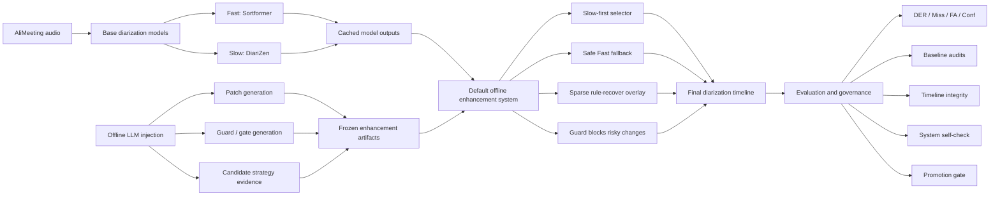
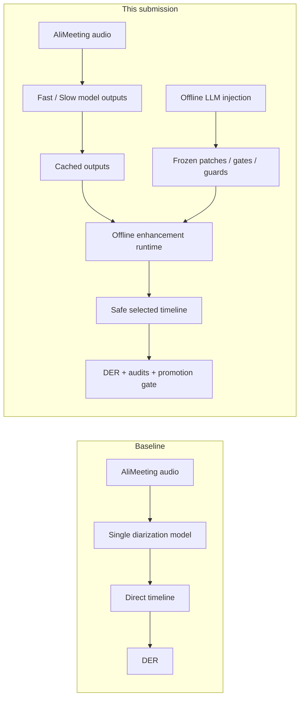

# AliMeeting Diarization Bench

Reproducible benchmark and offline realtime speaker-diarization enhancement
system for the AliMeeting Eval set.

This repository is the final submission workspace for the current development
pool result. The deliverable is an offline, replayable diarization enhancement
pipeline with batch orchestration, timeline exports, baseline audits, promotion
gates, and self-check reports.

## Current Submission Result

The current default system is:

```text
slow_guarded_fast_fallback_rare_audio_rule_recover
```

Latest verified development-pool result:

| Metric | Value |
|---|---:|
| Evaluation pool | 8 AliMeeting Eval recordings, 120 windows |
| Window size | 30 seconds |
| Final DER | 16.4923% |
| Fast baseline DER | 28.5637% |
| Slow baseline DER | 16.8809% |
| Best tracked baseline | slow_base |
| Margin vs best tracked baseline | +0.3886pp |
| Beats tracked same-window baselines | true, 5/5 |
| Miss / FA / Confusion | 5.2621% / 6.3883% / 4.8431% |
| Live API calls in default system | 0 |
| First-output latency proxy avg / p95 | 0.383s / 0.444s |
| Rule-writeback latency proxy avg / p95 | 24.65s / 28.33s |
| Processed cached-window audio | 3600.0s |
| Offline replay RTF | 0.000855 |
| Full system regression | pass, 29/29 |
| System self-check | warn, 40 pass / 4 warn / 0 fail |

Important boundary: this is a development-pool result, not a final
generalization claim. The promotion gate is still blocked by weak selector
robustness, weak recording-level stability, and the absence of a sealed
true-heldout split.

## What Is Delivered

- Benchmark CLI for AliMeeting diarization experiments:
  `alimeeting_diarization_bench/run.py` / `alimeeting-bench`
- One-command quick start:
  `alimeeting_diarization_bench/final/quick_start.py` / `alimeeting-quick-start`
- Model wrappers for Sortformer, DiariZen, PyAnnote, Qwen/DashScope, Omni, and
  GPT audio paths under `alimeeting_diarization_bench/models/`.
- Offline realtime enhancement pipeline:
  `alimeeting_diarization_bench/final/realtime_system.py` / `alimeeting-realtime`
- Batch runner with per-recording output directories:
  `alimeeting_diarization_bench/final/realtime_batch.py` / `alimeeting-batch`
- End-to-end regression runner:
  `alimeeting_diarization_bench/final/regression.py` / `alimeeting-regression`
- Self-check and audit modules for timeline integrity, baseline fairness,
  source inventory, promotion readiness, and true-heldout readiness.
- Reproducible output artifacts under `outputs/`.

## Final Framework

The final system is an LLM-prepared offline diarization enhancement framework.
LLM/agent components are used before runtime to create frozen patches, gates,
guards, and candidate evidence. The default submitted runtime reads those
artifacts and performs zero live LLM/API calls.



Short description:

```text
Sortformer and DiariZen provide the base diarization timelines.
LLM injection prepares patches, gates, and guard evidence offline.
The submitted runtime consumes frozen artifacts, selects safe changes, and
exports the final timeline plus complete audit reports.
```

## Difference From Baselines

Baseline methods are direct model outputs. This submission is an enhancement
framework over those outputs.



| Aspect | Baseline | This submission |
|---|---|---|
| Core method | Single model output | Fast/Slow model outputs plus enhancement runtime |
| Main runtime path | Direct timeline | Slow-first selector |
| LLM involvement | None | Offline patch/gate/guard preparation |
| Live LLM/API during default run | Not applicable | 0 calls |
| Correction mechanism | None or fixed model behavior | Sparse rule-recover overlay |
| Risk control | Usually absent | Guard/quarantine gate |
| Reproducibility | Depends on rerunning model inference | Cached outputs plus frozen artifacts |
| Verification | DER only | DER, baseline audits, timeline integrity, self-check, promotion gate |
| Current DER | Best baseline slow_base: 16.8809% | 16.4923% |
| Current margin | - | +0.3886pp vs best tracked baseline |

The improvement is not a new single baseline model. It comes from a
runtime-safe, auditable enhancement layer over the baseline outputs.

## Repository Layout

```text
alimeeting_diarization_bench/
  run.py                         # Benchmark CLI
  cli.py                         # Installed final-submission command dispatcher
  final/                         # Final offline runtime, batch, regression, audits
  evaluation/runner.py           # Segment evaluation and CSV/JSON export
  models/                        # Model adapters
  metrics/der.py                 # DER scoring
outputs/
  system_demo/all_cached_recordings/
  realtime_batch/
  system_regression/
  system_self_check/
  system_promotion_gate/
  true_heldout_readiness/
```

## Prerequisites

Use Python 3.10 or newer. Python 3.11 is recommended for this workspace.

The default offline system does not need API keys because it replays cached
Fast/Slow model outputs and cached feature artifacts. Live model reproduction
does require the corresponding local environments, model caches, and optional
API credentials.

Expected AliMeeting local data layout:

```text
~/data/AliMeeting/Eval_Ali/Eval_Ali_far/audio_dir/
~/data/AliMeeting/AliMeeting_manifests/
```

The default paths can be overridden with environment variables:

```bash
export ALIMEETING_AUDIO_DIR=~/data/AliMeeting/Eval_Ali/Eval_Ali_far/audio_dir
export ALIMEETING_MANIFEST_DIR=~/data/AliMeeting/AliMeeting_manifests
```

Optional environment variables for live/non-cached model experiments are listed
in `.env.example`.

## Installation

From the repository root:

```bash
python -m pip install -e .
```

Verify the CLI wiring:

```bash
alimeeting-bench --help
```

The same benchmark CLI is also available as:

```bash
python -m alimeeting_diarization_bench.run --help
```

Final submission helper commands installed by `pyproject.toml`:

```text
alimeeting-final
alimeeting-quick-start
alimeeting-realtime
alimeeting-batch
alimeeting-regression
alimeeting-self-check
alimeeting-timeline-check
```

The help output should include these model IDs:

```text
fun_asr, paraformer_v2, omni_plus, asr_flash, gpt4o_audio,
pyannote, pyannote_community, diarizen, sortformer
```

It should also include this speaker-count option:

```text
--speaker-count-mode {oracle,none,bounds,hint}
```

## Quick Start

Run the shortest offline reproduction path:

```bash
alimeeting-quick-start
```

Equivalent module form:

```bash
python -m alimeeting_diarization_bench.final.quick_start
```

This regenerates the all-cached default system under:

```text
outputs/quick_start/all_cached_recordings/
```

Expected terminal summary:

```text
final DER: 16.4923%
margin vs best baseline: 0.3886pp
beats all tracked baselines: true
processed audio: 3600.0s
offline replay RTF: prints the current machine's measured value
live API calls: DeepSeek=0, Qwen=0, Omni=0
```

This command does not call live LLM/API services and does not rerun
Sortformer or DiariZen. It only replays cached model outputs and frozen
enhancement artifacts.

## Reproduction Path A: Reuse Cached Outputs

This is the fastest and most reliable way to reproduce the submitted result.
It does not call any live API.

### 1. Run the all-cached offline system

```bash
python -m alimeeting_diarization_bench.final.realtime_system \
  --all-cached-recordings \
  --output-dir outputs/system_demo/all_cached_recordings
```

Expected key artifact:

```text
outputs/system_demo/all_cached_recordings/metrics.json
```

Expected metrics:

```text
windows_processed = 120
recordings_processed = 8
evaluation_status = scored_with_cached_reference
metrics.final_der = 0.16492333333333334
metrics.der_delta_vs_best_baseline_pp = 0.38858333333333384
baseline_win_summary.beats_all_baselines = true
metrics.processed_audio_sec = 3600.0
metrics.offline_replay_rtf ~= 0.000855
metrics.deepseek_api_calls = 0
metrics.qwen_api_calls = 0
metrics.omni_api_calls = 0
```

### 2. Run timeline integrity

```bash
python -m alimeeting_diarization_bench.final.timeline_integrity
```

Expected artifact:

```text
outputs/timeline_integrity/final_timeline_integrity.json
```

Expected status:

```text
status = pass
fail_count = 0
warn_count = 0
```

### 3. Run the batch path

```bash
python -m alimeeting_diarization_bench.final.realtime_batch \
  --all-cached-recordings \
  --output-dir outputs/realtime_batch/all_cached
```

Expected artifact:

```text
outputs/realtime_batch/all_cached/batch_summary.json
```

Expected summary:

```text
status = pass
summary.items = 8
summary.passed_items = 8
summary.windows_processed = 120
summary.final_der = 0.16492333333333334
summary.deepseek_api_calls = 0
summary.qwen_api_calls = 0
summary.omni_api_calls = 0
```

### 4. Audit batch consistency

```bash
python -m alimeeting_diarization_bench.final.audit_realtime_batch_consistency
```

Expected artifact:

```text
outputs/realtime_batch/audit/realtime_batch_consistency.json
```

Expected status:

```text
status = pass
pass_count = 9
fail_count = 0
summary.final_der_abs_gap_pp = 0.0
```

### 5. Run full regression

```bash
python -m alimeeting_diarization_bench.final.regression
```

Expected artifact:

```text
outputs/system_regression/realtime_system_regression.json
```

Expected status:

```text
status = pass
passed_steps = 29
total_steps = 29
metrics_summary.final_der = 0.16492333333333334
metrics_summary.beats_all_baselines = true
self_check_summary.status = warn
self_check_summary.pass_count = 40
self_check_summary.warn_count = 4
self_check_summary.fail_count = 0
```

The regression refreshes the main derived artifacts and then runs the
self-check. It may take several minutes because it rebuilds feature, selector,
sanitization, candidate-search, promotion, and diagnostic reports.

## Reproduction Path B: Manual Regression Sequence

Use this when you need to debug one stage at a time. The full regression runner
above executes these stages in order.

```bash
python -m alimeeting_diarization_bench.final.build_audio_window_features
python -m alimeeting_diarization_bench.final.validate_guarded_slow_selector
python -m alimeeting_diarization_bench.final.search_system_selector_policies
python -m alimeeting_diarization_bench.final.search_rare_selector_overlay_policies
python -m alimeeting_diarization_bench.final.search_slow_sanitization_policies
python -m alimeeting_diarization_bench.final.search_speaker_track_sanitization_policies
python -m alimeeting_diarization_bench.final.search_audio_guided_sanitization_policies
python -m alimeeting_diarization_bench.final.search_audio_boundary_adjustment_policies
python -m alimeeting_diarization_bench.final.realtime_system \
  --all-cached-recordings \
  --output-dir outputs/system_demo/all_cached_recordings
python -m alimeeting_diarization_bench.final.realtime_batch \
  --recording-ids R8003_M8001,R8009_M8019 \
  --output-dir outputs/realtime_batch/smoke
python -m alimeeting_diarization_bench.final.realtime_batch \
  --all-cached-recordings \
  --output-dir outputs/realtime_batch/all_cached
python -m alimeeting_diarization_bench.final.audit_realtime_batch_consistency
python -m alimeeting_diarization_bench.final.timeline_integrity
python -m alimeeting_diarization_bench.final.audit_clipped_baselines
python -m alimeeting_diarization_bench.final.audit_baseline_leaderboard
python -m alimeeting_diarization_bench.final.audit_runtime_overlay_contributions
python -m alimeeting_diarization_bench.final.audit_recording_level_stability
python -m alimeeting_diarization_bench.final.search_recording_balanced_overlays
python -m alimeeting_diarization_bench.final.search_recording_balanced_overlays \
  --previous-window-context \
  --output-dir outputs/recording_context_overlay_search
python -m alimeeting_diarization_bench.final.audit_external_candidate_source_inventory
python -m alimeeting_diarization_bench.final.search_external_candidate_surfaces
python -m alimeeting_diarization_bench.final.build_external_candidate_reproduction_plan
python -m alimeeting_diarization_bench.final.audit_baseline_headroom
python -m alimeeting_diarization_bench.final.build_system_promotion_gate
python -m alimeeting_diarization_bench.final.diagnose_true_heldout_readiness
python -m alimeeting_diarization_bench.final.diagnose_selector_robustness
python -m alimeeting_diarization_bench.final.diagnose_recording_stability_blockers
python -m alimeeting_diarization_bench.final.build_research_next_experiment_queue
python -m alimeeting_diarization_bench.final.self_check
```

The final command writes:

```text
outputs/system_self_check/realtime_system_self_check.json
outputs/system_self_check/realtime_system_self_check.md
```

## Reproduction Path C: Recompute Base Model Outputs

The submitted default system uses cached Fast/Slow summaries:

```text
outputs/sortformer_uv_120/nemo-sortformer-4spk-v1/default__spk_none/summary.json
outputs/diarizen_uv_120/diarizen-large-v2/default__spk_none/summary.json
```

To refresh Sortformer:

```bash
.venv_sortformer/bin/python -m alimeeting_diarization_bench.run \
  --model sortformer \
  --window-size 30 \
  --sampling-mode stratified \
  --total-samples 120 \
  --seed 42 \
  --speaker-count-mode none \
  --output-dir outputs/sortformer_uv_120
```

To refresh DiariZen:

```bash
.venv_diarizen/bin/python -m alimeeting_diarization_bench.run \
  --model diarizen \
  --window-size 30 \
  --sampling-mode stratified \
  --total-samples 120 \
  --seed 42 \
  --speaker-count-mode none \
  --output-dir outputs/diarizen_uv_120
```

If you refresh either model summary, rerun Reproduction Path A or B before
using any reported metric.

## External Candidate Surface Reproduction

The external candidate search only promotes runtime-deployable sources. Oracle
speaker-count sources are excluded from deployability search by default and are
reported as eval-only diagnostics.

Inventory all candidate sources:

```bash
python -m alimeeting_diarization_bench.final.audit_external_candidate_source_inventory
```

Search deployable external overlays:

```bash
python -m alimeeting_diarization_bench.final.search_external_candidate_surfaces
```

Expected current status:

```text
outputs/external_candidate_source_inventory/external_candidate_source_inventory.json
  status = pass
  summary.runtime_windows = 120
  summary.sources_scanned = 49
  summary.full_coverage_clean_sources = 3

outputs/external_candidate_surface_search/external_candidate_surface_search.json
  status = external_candidate_surface_not_deployable
  candidate_sources = 11
  eval_only_oracle_sources_excluded = 2
  candidate_policies = 826
  best_policy.delta_vs_current_pp = 0.00016666666666498298
```

The best deployable external policy is too small to promote. The eval-only
external oracle shows remaining headroom, but it cannot be used as a default
runtime path.

## Output Artifacts

Core system artifacts:

```text
outputs/system_demo/all_cached_recordings/fast_timeline.json
outputs/system_demo/all_cached_recordings/fast_timeline.csv
outputs/system_demo/all_cached_recordings/fast_timeline.rttm
outputs/system_demo/all_cached_recordings/final_timeline.json
outputs/system_demo/all_cached_recordings/final_timeline.csv
outputs/system_demo/all_cached_recordings/final_timeline.rttm
outputs/system_demo/all_cached_recordings/correction_log.json
outputs/system_demo/all_cached_recordings/correction_log.csv
outputs/system_demo/all_cached_recordings/window_metrics.json
outputs/system_demo/all_cached_recordings/window_metrics.csv
outputs/system_demo/all_cached_recordings/recording_metrics.json
outputs/system_demo/all_cached_recordings/recording_metrics.csv
outputs/system_demo/all_cached_recordings/baseline_comparison.json
outputs/system_demo/all_cached_recordings/baseline_comparison.csv
outputs/system_demo/all_cached_recordings/metrics.json
outputs/system_demo/all_cached_recordings/metrics.md
```

Verification and report artifacts:

```text
outputs/system_regression/realtime_system_regression.json
outputs/system_regression/realtime_system_regression.md
outputs/system_self_check/realtime_system_self_check.json
outputs/system_self_check/realtime_system_self_check.md
outputs/realtime_batch/all_cached/batch_summary.json
outputs/realtime_batch/audit/realtime_batch_consistency.json
outputs/timeline_integrity/final_timeline_integrity.json
outputs/clipped_baseline_audit/clipped_baseline_audit.json
outputs/baseline_leaderboard_audit/baseline_leaderboard_audit.json
outputs/runtime_overlay_contributions/runtime_overlay_contributions.json
outputs/recording_level_stability/recording_level_stability.json
outputs/system_promotion_gate/system_promotion_gate.json
outputs/true_heldout_readiness/true_heldout_readiness.json
outputs/selector_robustness_diagnosis/selector_robustness_diagnosis.json
outputs/recording_stability_blockers/recording_stability_blockers.json
outputs/research_progress_snapshot/next_experiment_queue.json
```

Search artifacts:

```text
outputs/system_selector_search/system_selector_policy_search.json
outputs/rare_selector_search/rare_selector_policy_search.json
outputs/slow_sanitization_search/slow_sanitization_policy_search.json
outputs/speaker_track_sanitization_search/speaker_track_sanitization_policy_search.json
outputs/audio_guided_sanitization_search/audio_guided_sanitization_policy_search.json
outputs/audio_boundary_adjustment_search/audio_boundary_adjustment_policy_search.json
outputs/recording_balanced_overlay_search/recording_balanced_overlay_search.json
outputs/recording_context_overlay_search/recording_balanced_overlay_search.json
outputs/external_candidate_source_inventory/external_candidate_source_inventory.json
outputs/external_candidate_surface_search/external_candidate_surface_search.json
outputs/external_candidate_reproduction_plan/external_candidate_reproduction_plan.json
```

## Metric Interpretation

The default system is a deployable offline replay path for the current cached
input pool:

- It uses cached Sortformer and DiariZen outputs.
- It uses runtime features and precomputed local audit artifacts.
- It performs zero live DeepSeek, Qwen, Omni, GPT, or HuggingFace calls in the
  default offline system path.
- DER, Miss, FA, and Confusion are only valid when
  `evaluation_status = scored_with_cached_reference`.

Realtime parameter:

```text
offline_replay_rtf = total_processing_wall_time_sec / processed_audio_sec
```

For the current submitted cached run:

```text
processed_audio_sec = 3600.0
total_processing_wall_time_sec = 3.0787
offline_replay_rtf = 0.000855
```

This parameter measures the default offline replay/enhancement runtime. It does
not include fresh Sortformer/DiariZen model inference time. For user-perceived
latency, also report:

```text
first_output_latency_proxy_avg_sec = 0.383
first_output_latency_proxy_p95_sec = 0.444
rule_writeback_latency_proxy_avg_sec = 24.65
rule_writeback_latency_proxy_p95_sec = 28.33
```

Do not claim generalization from these numbers alone. The current promotion
gate intentionally separates development-pool success from robust promotion.

Current promotion status:

```text
outputs/system_promotion_gate/system_promotion_gate.json
  status = dev_metric_pass_promotion_blocked
  development_metric_status = pass
  promotion_status = blocked
```

Current blockers:

```text
base selector status = weak_dev_gain_not_robust
rare selector status = weak_dev_gain_not_robust
recording-level stability = weak_recording_level_gain_not_robust
true-heldout readiness = blocked_missing_sealed_split_and_new_recordings
```

Recording-level stability:

```text
positive recordings = 5/8
non-positive recordings = R8001_M8004, R8008_M8013, R8009_M8020
```

The current Fast/Slow/rule candidate pool has no remaining clipped-candidate
oracle gain on those three non-positive recordings. The next real optimization
task is a new deployable candidate surface for those recordings, not more
tuning of the exhausted current candidate pool.

## One-Command Verification Checklist

Run this after any code change before reporting a metric:

```bash
python -m py_compile \
  alimeeting_diarization_bench/run.py \
  alimeeting_diarization_bench/cli.py \
  alimeeting_diarization_bench/evaluation/runner.py \
  alimeeting_diarization_bench/final/realtime_system.py \
  alimeeting_diarization_bench/final/realtime_batch.py \
  alimeeting_diarization_bench/final/regression.py \
  alimeeting_diarization_bench/final/self_check.py \
  alimeeting_diarization_bench/final/search_external_candidate_surfaces.py

python -m alimeeting_diarization_bench.run --help
python -m alimeeting_diarization_bench.cli --help
python -m alimeeting_diarization_bench.final.regression
```

The submission is reproducible only if the final regression still reports:

```text
status = pass
passed_steps = 29
total_steps = 29
metrics_summary.final_der = 0.16492333333333334
metrics_summary.beats_all_baselines = true
self_check_summary.fail_count = 0
```

## Troubleshooting

- If `python3` fails on modern typing syntax, use `python` from the configured
  Python 3.10+ environment.
- If local model refresh fails, first reproduce with cached outputs. The
  submitted default metric does not require live inference.
- If `outputs/system_self_check/...` reports warnings but no failures, inspect
  the warning codes before changing the default runtime. Current warnings are
  expected promotion blockers, not execution failures.
- If any model summary is refreshed, rerun the full regression before using
  the resulting metric.
- If a result is `no_reference`, DER fields are not evaluated metrics and must
  not be reported as benchmark results.
